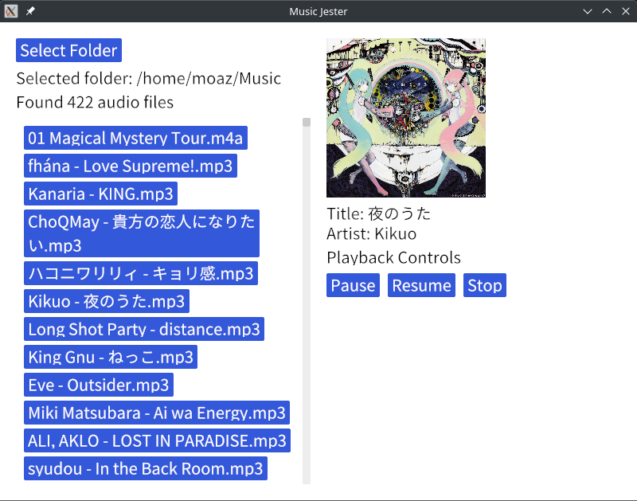

# Music Jester - CS50 Final Project
### Video Demo: https://youtu.be/nyk0zcgRFqM
### 🎵 Music Jester: A Rust-Based GUI Audio Player:

Music Jester is a desktop audio player written in Rust, developed as a final project for CS50. It blends the power and safety of Rust with modern GUI components provided by the Iced framework, creating an elegant, interactive, and responsive music player. Music Jester allows users to browse local folders for audio files, display and play them, and even view embedded album art and metadata such as song title and artist.

### ℹ️ How to Install?
Step 1: Install Rust:
You can install rust by going to https://www.rust-lang.org/tools/install and following the onscreen instructions

Step 2: open your folder in the terminal using "cd" and run the following commands

    cargo build

then:

    cargo run

### 🧱 Architecture and Core Libraries:
Music Jester is built on a foundation of several robust libraries:

    Iced: A cross-platform GUI library for Rust, inspired by Elm, used for creating the user interface.

    Rodio: A high-level audio playback library for playing various audio formats.

    Lofty: A metadata parser for reading audio tags (ID3, Vorbis comments, etc.), used to extract title, artist, and embedded album art.

    rfd: A native file dialog library for selecting folders and files.

    std::fs and std::path: For filesystem operations like scanning folders for audio files.

These libraries work in tandem to deliver a fully interactive desktop application.

### 🖥️ User Interface & UX
Music Jester presents a clean split interface:
Left Column

    A “Select Folder” button, which opens a folder picker using rfd::FileDialog.

    The currently selected folder path.

    A scrollable list of detected audio files in the folder and subfolders.

    Status messages about scan progress (e.g., "Scanning..." or "Found X audio files").

Right Column

    Displays the album art (if available) or a fallback image if not.

    Shows metadata (song title and artist).

    Playback controls: Pause, Resume, and Stop.

The layout adapts to user interaction in real-time. For example, when a file is played, the UI updates with album art and metadata.

### 🧠 Application Logic

main functionalities:
1. Folder Selection & Scanning

When the user clicks the “Select Folder” button, a native file dialog opens. Once a folder is selected, the application recursively scans for supported audio files (mp3, m4a, flac, wav, ogg). The search is asynchronous, ensuring the GUI remains responsive.

The function find_audio_files() traverses the folder recursively using std::fs::read_dir and checks file extensions with is_supported_audio_file().
2. Audio Playback

When a file is selected for playback:

    Any existing playback is stopped by halting the previous sink.

    A new rodio::OutputStream and Sink are created for playback.

    The file is opened, buffered, and decoded using Rodio.

    Playback begins immediately with sink.play().

This provides smooth, efficient playback while ensuring only one stream plays at a time.
3. Metadata and Album Art

After starting playback, Music Jester extracts metadata:

    Album Art: extract_album_art() uses Lofty to read embedded images and returns the first picture as raw bytes.

    Title & Artist: extract_metadata() retrieves common tags like song title and artist name.

If metadata or album art is not available, Music Jester falls back to default values (e.g., displaying “No metadata available” and a bundled fallback image).
4. Playback Controls

Users can pause, resume, or stop playback using buttons in the right-side panel:

    PausePlayback pauses the current sink.

    ResumePlayback resumes it.

    StopPlayback halts and resets the current sink, also clearing metadata and artwork from the UI.

This logic is handled in the update() function, where every message (user action) updates the application state accordingly.

### 🚀 Why did I choose Rust?
Rust provides several key benefits for an app like Music Jester:

    Memory Safety: Eliminates segmentation faults and memory leaks.

    Concurrency: The async design allows smooth folder scanning and metadata extraction without blocking the UI.

    Performance: Rust’s speed ensures audio decoding and UI rendering remain fast and responsive.

Combining these features with Iced’s modern GUI support makes Rust a surprisingly great choice for desktop application development.

### 🌟 Final Thoughts
Music Jester is more than a simple music player—it’s a polished, production-quality Rust app that showcases advanced concepts such as:

    GUI design using Iced.

    Real-time audio playback with Rodio.

    Metadata parsing via Lofty.

    Responsive async design.

    Asset bundling and platform-native dialog integration.

It’s an excellent demonstration of what modern Rust can achieve beyond systems programming. As a CS50 final project, it’s both technically impressive and functionally practical, offering a user-friendly interface backed by high-performance and safe Rust code.